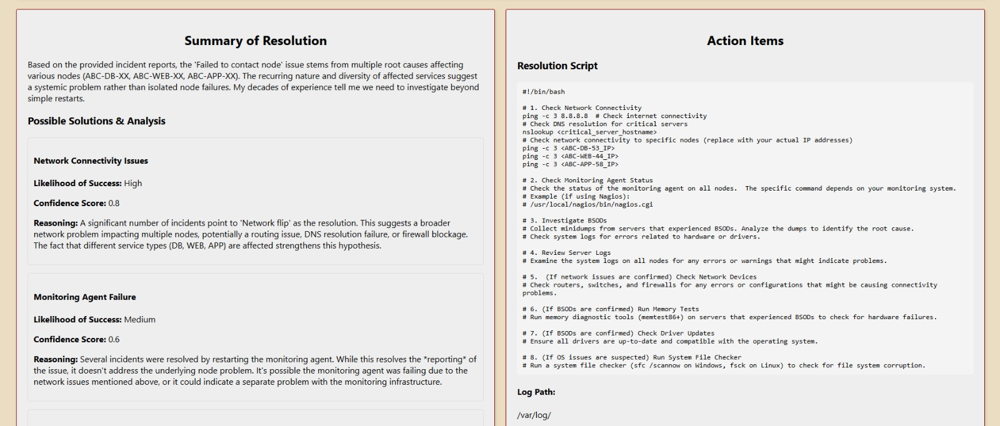

# 🚀 UNITI - Unified Networked Infra & Tech Intelligence

## 📌 Table of Contents
- [Introduction](#Introduction)
- [Demo](#Demo)
- [Inspiration](#Inspiration)
- [What It Does](#what-it-does)
- [How We Built It](#how-we-built-it)
- [Challenges We Faced](#challenges-we-faced)
- [How to Run](#how-to-run)
- [Tech Stack](#tech-stack)
- [Team](#team)

---

## 🎯 Introduction
IT operations can be overwhelming—incidents pile up, related issues are scattered across different systems, and engineers spend hours manually troubleshooting problems. Our project is designed to make life easier for system engineers by bringing everything they need into one intelligent, AI-powered assistant.

By integrating ServiceNow, Google Vertex AI, and Gemini 2.0, our platform automates incident management, correlates related issues, and even suggests or executes fixes using AI-generated scripts. Instead of digging through dashboards and logs, engineers get instant, context-aware insights, real-time telemetry data, and actionable AI-driven resolutions—all in one place.

With built-in automation and Ansible playbook execution, teams can resolve issues faster, reduce manual work, and keep systems running smoothly. Our goal? To take the frustration out of IT operations and give engineers the tools they need to work smarter, not harder.

## 🎥 Demo 
📹 [Video Demo](artifacts/demo/Video_demo.mp4)

🖼️ Screenshots:





## 💡 Inspiration
Sajeev and Abhishek, with years of experience in infrastructure and troubleshooting, faced the challenge of managing data across multiple tools to resolve issues efficiently. They envisioned a unified platform that consolidates all information in one place, streamlining the troubleshooting process for system engineers.

Pallavi and Varun, as forward-thinking developers, saw the potential of AI to enhance this process, offering intelligent insights and automation to speed up issue resolution and proactive remediation. Together, they aimed to transform system engineering with a smarter, more efficient approach.


## ⚙️ What It Does
   ### Features
   - #### ServiceNow API Integration:
      Seamless connectivity with ServiceNow for streamlined operations and incident management.
   - #### Google Vertex LLM: 
      Leverage the power of Google’s Vertex Large Language Model for intelligent insights and automation.
   - #### Google Gemini 2.0 Chatbot
      Advanced conversational AI for efficient communication and issue resolution.
   ### Functionalities
   - #### Unified Information Hub for System Engineers: 
      A single pane of glass for system engineers to access critical data and insights.
   - #### Contextual Incident, Change, and Problem Correlation:
      Automatically links related incidents, changes, and problems for faster issue resolution.
   - #### Telemetry Data Insights for CIs: 
      Telemetry data associated with Configuration Items (CIs) for better decision-making and proactive maintenance.
   - #### AI-Driven Incident Resolution: 
      Utilize AI-powered Large Language Models to propose accurate solutions for incidents, reducing manual intervention.
   - #### Automated Remediation with AI-Curated Scripts: 
      Remediate issues efficiently using AI-generated scripts, ensuring quick and precise actions.
   - #### Ansible Integration for Playbook Execution: 
      Seamlessly integrate Ansible for the execution of pre-defined automation playbooks, accelerating problem resolution.

## 🛠️ How We Built It
   ### Technologies
   - Javascript
   - REST API
   - Google Vertex AI
   - Google Gemini
   - ServiceNow
   ### Tools
   - Visual Studio Code
   - PowerShell
   - Google CLI
   - GPT4

## 🚧 Challenges We Faced
- creating DataSets related to Incidents, Telemetry, KB Data
- paid subscriptions to LLM's

## 🏃 How to Run
1. Clone the repository  
   ```sh
   git clone https://github.com/ewfx/gaipl-neural-norm.git
   ```
2. Install dependencies  
   ```sh
   npm install
   ```
3. Populate the .env file in both Frontend/Backend.
4. Add a System Environment Variable and map it to GCP Service Account JSON file locally.
   ```sh
   GOOGLE_APPLICATION_CREDENTIALS
   ```
   
5. Run the project Frontend 
   ```sh
   npm start
   ```
6. Run the projecct Backend
   ```sh
   node index.js
   ```

## 🏗️ Tech Stack
- 🔹 Frontend: React
- 🔹 Backend: Node.js
- 🔹 API: ServiceNow API, Google Vertex AI

## 👥 Team
- **Varun Taneja**
- **Pallavi Buwa**
- **Sajeev Philip**
- **Abhishek Mukherjee**
